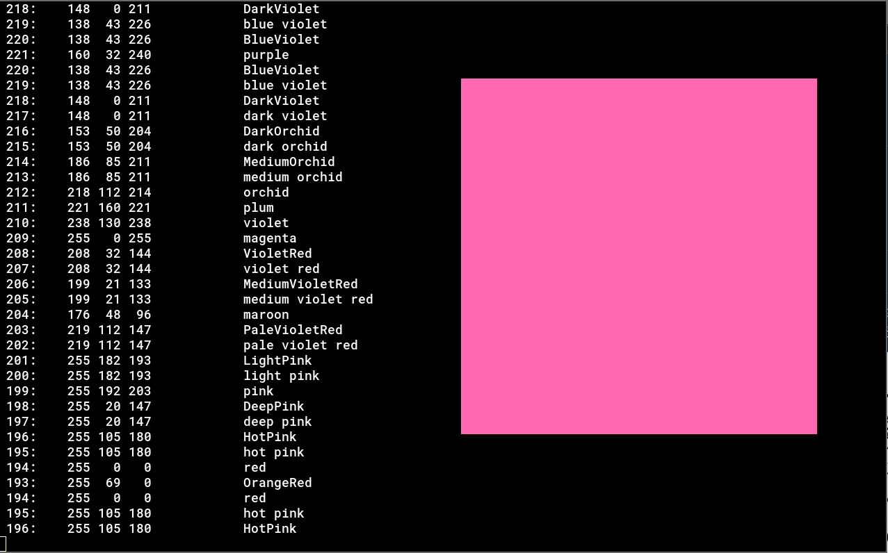

# XCOLORCHECK

- Display colors from RGB values or X color names input from stdin or the rgb.txt.

## SYNOPSIS
- `./xcolorcheck <file>`
  - Input from file
- `cat <file> | ./xcolorcheck`, `./xcolorcheck < <file>`
  - Input from stdin.
- Color names and RGB values are available.
- If both are given in one line; such as  `255 250 250 snow`, names or values at the beginning of the line take precedence.
- If you use the keyboard directly from the stdin, enter EOF with C-d at the end.
  
## KEY BINDS
- n
  - Next color
- p
  - Previous color
- q
  - Quit

## EXAMPLES
- `cat /etc/X11/rgb.txt | ./xcolorcheck` 
  - Input from the rgb.txt
- `cat /etc/X11/rgb.txt | grep blue | ./xcolorcheck`
  - Input colors contains 'blue' in the rgb.txt.

## AUTHOR
- Mugi Noda (void-hoge)

## LICENSE
- GPLv3
